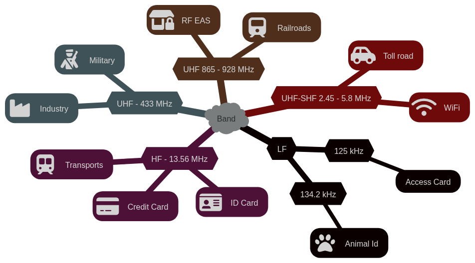
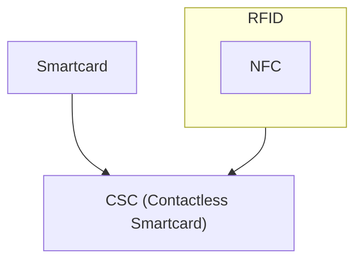
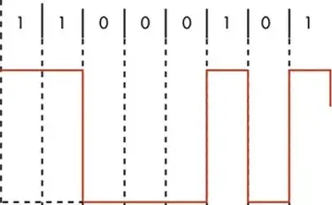
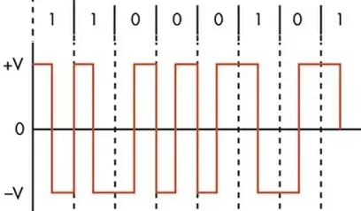
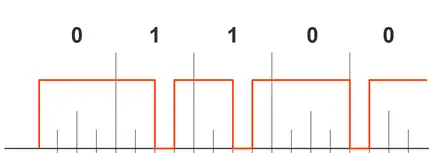
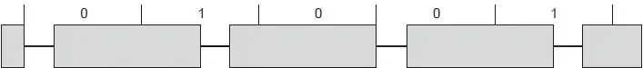
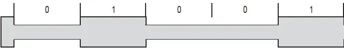
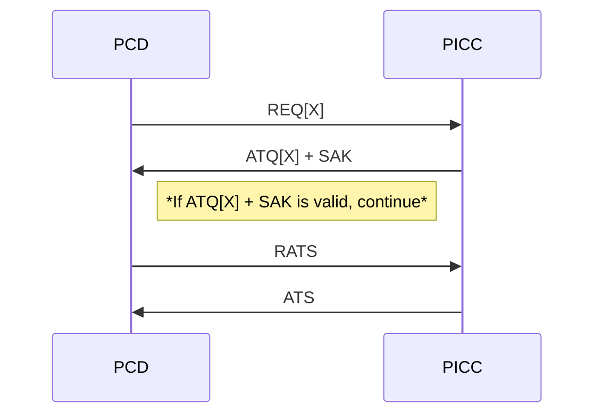

# 📡 RFID Vulnerabilities 🏧💳

## Overview

This project aims to find the most suitable RFID technology for your use case, or alternatives, in addition to explain why your current solution may not be appropriate.

Moreover, a documentation is also available.


## Launch

```sh
$ docker swarm init --advertise-addr 127.0.0.1
$ docker-compose up --build
```

## What are RFID technologies ?

RFID (Radio Frequency Identification) technology designate, as the name suggest, a protocol that permits to identify someone or something.

## Where are RFID used ?

We use RFID technologies very often in our daily life, without us realizing it.
- Building or corporate pass
- Contactless payment
- Public transports
- Electronic Toll Collection
- ...

## What type of RFID exist ?

RFID is actually on many frequency bands.
| Abbrv | Band | Regulations | Typical Range | Max Range | ISO/IEC 18000 | Use Case |
|---|---|---|:---:|:---:|:---:|---|
| **LF** | **120 ~ 148 kHz** | ***Unregulated*** | **10cm** | **50 cm** | **Part 2** | **<ul><li>Identification Cards (125 kHz)</li><li>Animal identification (134.2 kHz)</li></ul>** |
| **HF** | **13.56 MHz** | **ISM band worldwide** | **10cm** | **1 m** | **Part 3** | **Most frequently used. Include Smartcards and NFC** |
| UHF | 433 MHz | Short range devices | *2m* | 100 m | Part 7 | <ul><li>Supplychain</li><li>Warehouse management</li><li>Military area</li></ul> |
| UHF | 865 ~ 868 MHz (EU)<br/>902–928 MHz (NA) | ISM band | 3m | 40 m | Part 6 | <ul><li>EAN codes</li><li>Railroads</li><li>Remote-control</li><li>Electronic Article Surveillance (RF EAS)</li></ul> |
| UHF-SHF | 2.45 ~ 5.8 GHz | ISM band | 15m | 90 m | Part 4 | <ul><li>Electronic toll collection</li><li>Railroads</li><li>802.11 WLAN</li><li>Bluetooth</li></ul> |

*[Source](https://en.wikipedia.org/wiki/Radio-frequency_identification), 
[433MHz](https://homey.app/en-us/wiki/433-mhz/)*



<!-- https://en.wikipedia.org/wiki/Box-drawing_characters -->
NFC is rooted in RFID, and Contactless Smartcard in NFC.


| Feature | RFID | NFC | CSC |
|-|-|-|-|
| Band | 125kHz* | 13.56 MHz | 13.56 MHz |
| UID | 4 or 7 bytes | 4 or 7 bytes | 4 or 7 bytes |
| Storage | *none* | 144, 504 or 888 bytes | 1, 2, 4 or 8 kB |
| Request treatment | ❌ | ✅ | ✅ |
| Authentication Support | ❌ | ❌ | ✅ |

**: When refering to RFID, it usually refers to this band*


| Card Type                      | Auth. Support | Type | NFC Type/RFID ISO | Cryptographic Support       | Manufacturer          |
| ------------------------------ | :----------------------: | :----: | :--------: | --------------------------- | --------------------- |
| **MIFARE Classic 1/2/4 kb**    | ✅                     | CSC | A | Crypto-1 (proprietary) ?     | NXP                   |
| **MIFARE DESFire EV1/EV2/EV3** | ✅                     | CSC | A | AES, 3DES                   | NXP                   |
| **MIFARE Plus**                | ✅                     | CSC | A | AES-128                     | NXP                   |
| **MIFARE Ultralight**          | ❌                     | NFC | A | None                        | NXP                   |
| **MIFARE Ultralight C/AES/EV1/NANO** | ✅               | CSC | A | 3DES/AES/ECC                    | NXP                   |
| **Hitag 1**                    | ✅                     | CSC | ISO 18000 (?) | Proprietary encryption ?     | NXP                   |
| **Hitag 2/S**                  | ✅                     | CSC | ISO 11784/85 | Proprietary encryption ?     | NXP                   |
| **ICODE**                      | ❌                     | NFC | V | None                        | NXP                   |
| **UCODE**                      | ✅                     | CSC | ISO 18000-4,6 | None ?                       | NXP                   |
| [**LEGIC Advant/Prime**][1]    | ✅                     | CSC | A or V | AES, DES, 3DES, LEGIC encryption | LEGIC Identsystems AG |
| **Temic T5567 Proximity Card** | ❌                     | RFID | ISO 11784/85 | Password-based protection ?  | Atmel (Microchip)     |
| **LRIAK/S2K/I512, ST25TB**     | ❌                     | NFC | B | None                        | STMicroelectronics    |
| **SRIX**                       | ✅                     | CSC | B | None (?)                    | STMicroelectronics    |

| Card Type                      | Auth. Support | Type | NFC Type/RFID ISO | Cryptographic Support       | Manufacturer          |
| ------------------------------ | ---------------------- | ---- | -------- | --------------------------- | --------------------- |
| **Token2 T2F2-NFC-Card PIN+**  | ✅                     | CSC | A | ECDSA, AES                  | Token2                |
| **JCOP 31/41**                 | ✅                     | CSC | A | DES, 3DES, RSA, ECC, AES    | IBM    |
| **INSIDE PicoPass 2KS**        | ✅                     | CSC | A | DES, 3DES                   | INSIDE                |
| **IS23SC, IS24C02**            | ❌                     | CSC | A | Password-based protection ?  | ISSI                  |
| **TI Tag-it HF-1**             | ✅                     | CSC | V | None (?)                        | Texas Instruments     |
| **EM4100-4550**                | ❌                     | RFID | ISO/IEC 18000-4 |  None                        | EM Microelectronic    |
| **Jewel**                      | ❌                     | CSC | A |                         |  Innovision/Broadcom  | |

[1]: https://www.legic.com/products/smartcards/legic-smartcard-ics "LEGIC"

[Source](https://nfc-tools.github.io/resources/standards/iso14443A/)

[ATQ, SAK and ATS can be used to identify the manufacturer and product.](https://nfc-tools.github.io/resources/standards/iso14443A/)

### Standards

| Standard | Description |
|-|-|
| NFCIP-1/2 (ISO/IEC 18092/21481) | Peer-to-Peer and Active Modes |
| ISO/IEC 18000-2 | RFID 120-135 kHz |
| ISO/IEC 18000-3 | RFID for item management at 13,56 MHz |
| ISO/IEC 18000-4 | RFID 860-960 MHz |
| ISO/IEC 18000-6 | RFID 2,45 GHz |
| ISO/IEC 14443 A/B | Proximity Cards (A and B) |
| [JIS X6319-4](https://img.antpedia.com/standard/files/pdfs_ora/20240408/JIS%20X%206319-4-2016.pdf) | Felicity Card / FeliCa (F) |
| ISO/IEC 15693 | Vicinity Cards (V) |
| NDEF (NFC Data Exchange Format) | Exchange payload format |

### Coding & Modulation

| Coding | Description | Example |
|-|-|-|
| NRZ-L | Voltage changes directly with bit-value logic | [](https://www.rfwireless-world.com/tutorials/other-wireless/nfc-modulation-explained) |
| Manchester | Inverse voltage at the middle of the bit period | [](https://www.rfwireless-world.com/tutorials/other-wireless/nfc-modulation-explained) |
| Modified Miller | 1 is always represented by high to low. 0 is mapped according to the previous bit condition: if previous bit was 1, then it remains high, otherwise a low impulse occurs at the beginning | [](https://www.physicsforums.com/threads/decoding-miller-code-understanding-the-high-and-low-signals.979900/) |

| Modulation | Description | |
|-|-|-|
| ASK 100% | The signal takes the full amplitude | [<p>Modified Miller</p>](https://www.rfwireless-world.com/terminology/modulation/10-percent-ask-vs-100-percent-ask-modulation) |
| ASK 10% | The signal lower by 10% for 0 | [<p>NRZ-L</p>](https://www.rfwireless-world.com/terminology/modulation/10-percent-ask-vs-100-percent-ask-modulation) |


### NFC Types

| Type | Mode | Coding | Modulation | Speed |
|:-:|-|-|-|-|
| A | *Polling*   | Modified Miller | ASK 100%      | 106 kbps |
|   | *Listening* | Manchester      | *Load (ASK)*  | 106 kbps |
| B | *Polling*   | NRZ-L           | ASK 10%       | 106 ~ 848 kbps |
|   | *Listening* | NRZ-L           | *Load (BPSK)* | 106 ~ 848 kbps |
| F | *Polling*   | Manchester      | ASK 10%       | 212 ~ 424 kbps | 
|   | *Listening* | Manchester      | *Load (BPSK)* | 212 ~ 424 kbps |
| V | *Polling*   | Manchester      | ASK 10%       | 26 ~ 53 kbps |
|   | *Listening* | Manchester      | *Load (ASK)*  | 26 ~ 53 kbps |

|                         | **Proximity Card A**                        | **Proximity Card B**                        | **Felicity Card (FeliCa)**             | **Vicinity Card**      |
| ----------------------- | ------------------------------------- | ------------------------------------- | ----------------------------------- | ------------------------------- |
| **Standard**            | ISO/IEC 14443-A                                     | ISO/IEC 14443-B                 | JIS X 6319-4 / ISO/IEC 18092        | ISO/IEC 15693                   |
| **NFC Tag Type**        | 1                                                   | ISO/IEC 14443-B                 | JIS X 6319-4 / ISO/IEC 18092        | ISO/IEC 15693                   |
| **Latency**             | Low                                                 | Low                             | Very low                            | Moderate                        |
| **Security**            | Depends on chip (e.g. MIFARE DESFire)               | Depends on chip (e.g. CAC, PIV) | High (built-in crypto, mutual auth) | Moderate (can support password) |
| **Main Use Cases**      | Access control, Payments, Government ID, Healthcare | Transports                      | Transit, Mobile payments, Access    | Industrial tracking, Libraries  |
| **Dominant Regions**    | Worldwide                                           | Europe, U.S. Government        | Japan, Hong Kong, Taiwan            | Europe, Industry (global)       |
| **Key Products**        | MIFARE Classic, DESFire, Ultralight                 | CAC cards, ePassports (ICAO)   | Suica, Octopus, Edy, nanaco         | Tag-it, ICODE, ST25             |


## Transaction Functioning



### Glossary

| Abbrv. | Meaning |
|-|-|
| ATQ[X] | Answer To Request, Type X |
| SAK | Select Acknowledge (anticollision byte) |
| ATS | Answer To Select |
| RATS | Request for Answer To Select |
| REQ[X] | Request Command, Type X |
| PCD | Proximity Coupling Device (Reader) |
| PICC | Proximity Integrated Circuit (Contactless card) |

## Techniques

| Attack | Objective | Description | Difficulty 1-3 ↑ | Defendable 0-2 ↑ | Harmfulness 0-3 ↓ | Scheme |
|---|:---:|---|:---:|:---:|:---:|:---:|
| Clone/Replay | Spoof | Clone/copy signal, to replay later | 1 | 2 | 3 |
| Relay | Steal | Relay the signal/ messages without altering them, to unlock or execute unwanted actions | 2 | 0 | 2 |
| Nonce Reuse / Mfkey32 | Spoof | Crack the key when 2 same nonces are used to encrypt different messages | 2 | 2 | 3 |
| Jamming | | Prevent a service to be used by producing a signal on the same frequency | 1 | 1 | 0 |
| Power Analysis | Spoof | The power supplied gives information about its instructions and data | 3 | 1 | 3 |
| Reverse Engineering | Research/Spoof | | 3 | 1 | 3 |
| Tracking | |  | 3 | 1 | 1 |

| **Difficulty** | **Description** |
|:---|---|
| 1 - Easy | Isn't very expensive (<500€), and doesn't require any expertise |
| 2 - Medium | Is expensive (>500€) and requires more expertise |
| 3 - Hard | Is very expensive (>2500€) and requires genuine expertise |
| **Harmfulness** |
| 0 - None | Isn't harmful for the client |
| 1 - Medium | Impact client's integrity/privacy |
| 2 - High | Ephemeral impact on client's interests/ownership |
| 3 - Critical | Long-term impact on client's interests/ownership |
| **Defendable** |
| 0 - No | Isn't defendable |
| 1 - Somewhat | Isn't completely defendable. Protections exist but they may not be very effective or are insufficients |
| 2 - Yes | Protections are fully effective |

## Devices

| Device                    | Type      | Read    | Write/Save/Emulate | Primary Use | Relay | MFKey32 - Nonce Reuse | Jamming | Power Analysis | Reverse Engineering | Price |
| ------------------------- | --------- | --------------- | ---------- | :---------: | :---: | :-------------------: | :-----: | :------------: | :-----------------: | :---  |
| **Flipper Zero**          | RFID, NFC | A, B, F, V      | A, F       | Replay      | ❌    | ✅                    | ❌      | ❌             | ❌                  | [190-300€](https://lab401.com/products/flipper-zero)  |
| **Proxmark3**             | CSC       | A, B, F, V      | A, B, F, V | RE          | ✅    | ✅                    | ⚠️      | ⚠️2            | ✅                  | [300-500€](https://lab401.com/products/proxmark-3-rdv4)  |
| **HydraNFC v2**           | CSC       | A, B, F, V      | A, B, F, V | RE          | ✅    | ✅                    | ❌      | ⚠️2            | ✅                  | [290€](https://hydrabus.com/product/hydrabus-v1-0-rev1-5-hydranfc-shield-v2-r1-5/?v=82a9e4d26595)  |
| **Android Smartphone**    | NFC       | A, B, F         | A, B, F    | -           | ⚠️1   | ❌                    | ❌      | ❌             | ⚠️1                 | - |
| **Tastic RFID Thief**     | RFID, NFC | ✅              | ✅         | Clone       | ❌    | ❌                    | ❌      | ❌             | ❌                  | [30€](https://cyborg.ksecsolutions.com/product/esp-rfid-tool/)  |
| [**Chameleon Mini/Ultra**][1] | RFID, CSC | RFID, A (MIFARE Classic/Ultralight) |  | RE | ❌  | ❌                 | ❌      | ❌             | ✅                  | [130€](https://lab401.com/products/chameleon-ultra)  |
| **ICopy XS**              | RFID, CSC | RFID, A, B, V | RFID, A, B, V | Replay     | ❌    | ✅                    | ❌      | ❌             | ❌                  | [375€](https://icopyx.com/)  |
| [**RFIDler**][2]          | 125-134 KHz | ✅            | ✅         | Replay      | ❌    | ❌                    | ❌      | ❌             | ✅                  | [95€](http://rfidiot.org/#Hardware) |
| **Frosch Hitag**          | RFID      | Hitag 1/2/S     | ✅         | RE          | ❌    | ❌                    | ❌      | ❌             | ✅                  | [165-180€](http://rfidiot.org/#Hardware) |
| **UV30 UHF/VHF Jammer**   | 140-480 MHz | ❌            | ❌         | Jamming     | ❌    | ❌                    | ✅      | ❌             | ❌                  |
| **All Frequency Jammer**  | GSM, 140-868MHz | ❌        | ❌         | Jamming     | ❌    | ❌                    | ✅      | ❌             | ❌                  |
| **RFMAX Power Mapper**    | 850-920 MHz | ❌            | ❌         | Power Analysis | ❌ | ❌                    | ❌      | ✅             | ❌                  |

- **RFID is written for 125 kHz specifally devices. CSC is written instead of NFC when encryption, decryption, or cracking is supported*
- *1: See [NFCGate](#software)*
- *2: See [Advanced devices](advanced-devices.md)*

[1]: https://github.com/RfidResearchGroup/ChameleonUltra "Chameleon Ultra"
[2]: https://github.com/AdamLaurie/RFIDler "RFIDler"

[RFIDIOt](http://rfidiot.org/#Hardware)

### Software
| Software/Application                     | Platform | Type | Read     | Emulate   | Relay | MFKey32 - Nonce Reuse | Jamming | Power Analysis | Reverse Engineering |
| ---------------------------------------- | -------- | ---- | -------- | --------- | ----- | --------------------- | ------- | -------------- | ------------------- |
| [**NFCGate**][1]                         | Android  | CSC  | A, B, F  | A, B, F   | ✅    | ❌                    | ❌       | ❌              | ✅                |
| [**Keysight 89600 VSA Software**][2]     | Windows  | NFC  | A, B, V  | ❌        | ❌    | ❌                    | ❌       | ✅              | ❌                |

[1]: https://github.com/nfcgate/nfcgate "NFCGate"
[2]: https://www.keysight.com/gb/en/lib/software-detail/computer-software/io-libraries-suite-downloads-2175637.html "Keysight IO Libraries Suite"
[3]: https://www.keysight.com/gb/en/assets/7018-06909/technical-overviews/5992-4223.pdf "RFID Modulation Analysis Technical Overview"

## Defense

| Software/Application                                      |
| --------------------------------------------------------- |
| **RSA/RFID Blocker Tag/Guardian**       |
| **VaultCard**             |


## Contributors

||||
|:-:|:-:|:-:|
| [<p>Aidasaoudi</p>](https://github.com/Aidasaoudi) | [<p>Rikimadi</p>](https://github.com/Rikimadi) | [<p>Mailysss</p>](https://github.com/Mailysss) |
| [<p>Eternal Dreamer</p>](https://github.com/MikeCod) | [<p>Agrafes</p>](https://github.com/Agrafes) | [<p>BAD0896</p>](https://github.com/badrou0809) |

## License

[LGPL](LICENSE)
